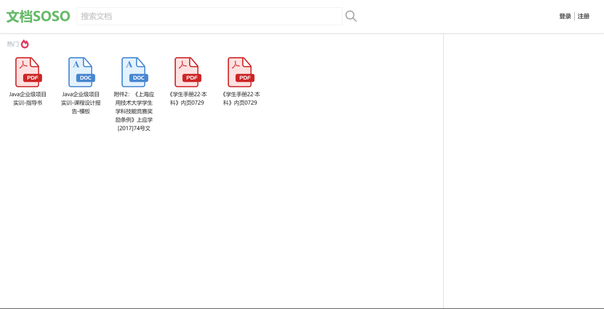
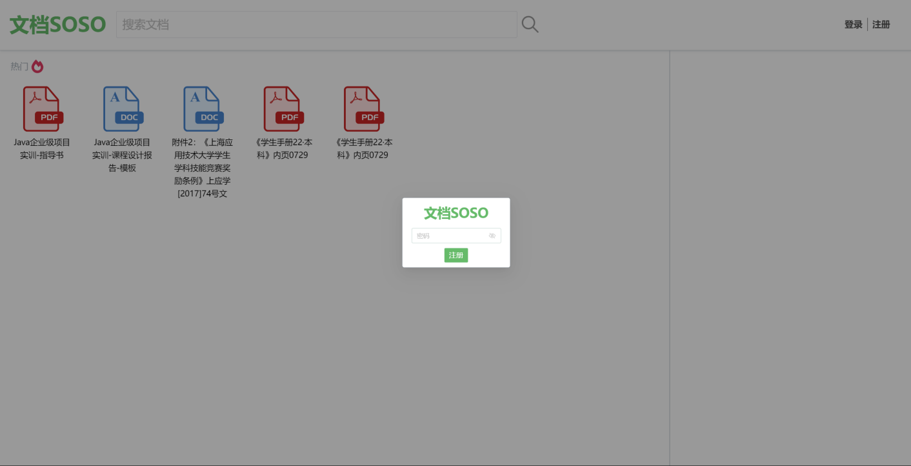
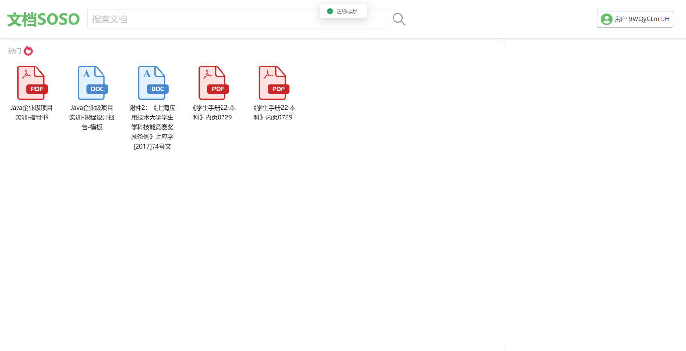
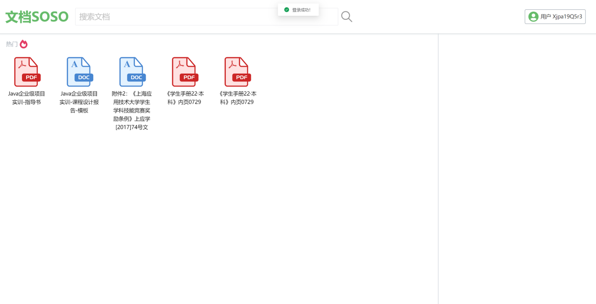
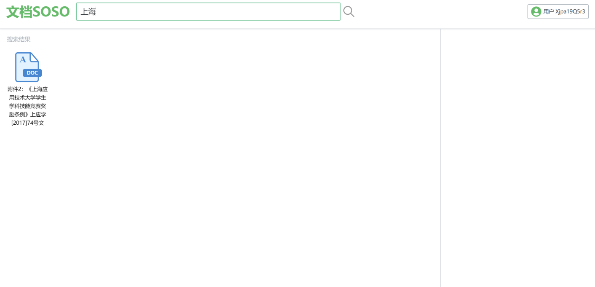
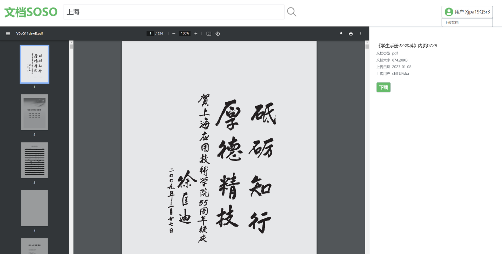
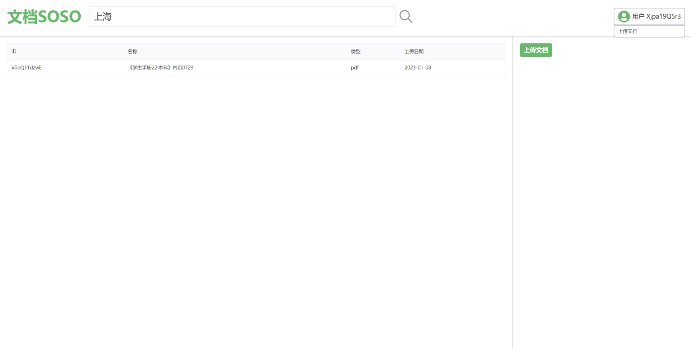
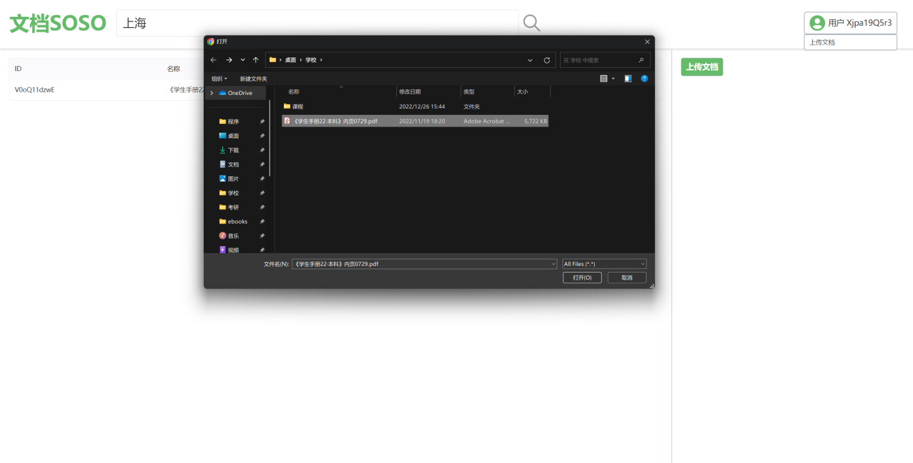
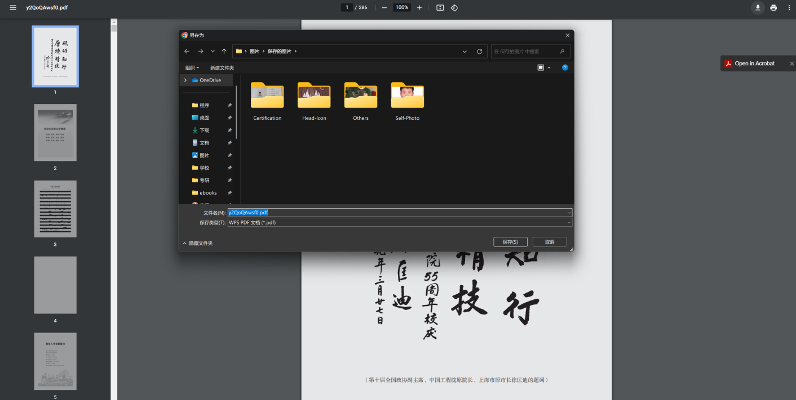

# Documents SOSO
English | [中文](./README.zh-CN.md)

## Project Background
Existing document-sharing websites like Baidu Docs, Docin, and Daoke Baba charge fees or require points to download documents. Therefore, the plan is to design a free document sharing website that is both simple and beautiful. Users can upload their own documents and download the documents they need for free. Additionally, it will offer online document previewing.

## Development Stack
This system adopts a front-end and back-end separation development model using JAVA + Vue.js. The back-end is developed using the SpringBoot + Mybatis framework, the database uses MySQL 8.0, and the front-end uses the Vue.js framework in conjunction with the Naive UI component library for secondary encapsulation and modification. The document preview function is implemented by deploying the kkFileView service.

## Feature Preview
1. **Homepage**

2. **Register**

3. **Login**

4. **Search Document**

5. **Document Preview**

6. **Uploaded Documents List**

7. **Upload Document**

8. **Download Document**
