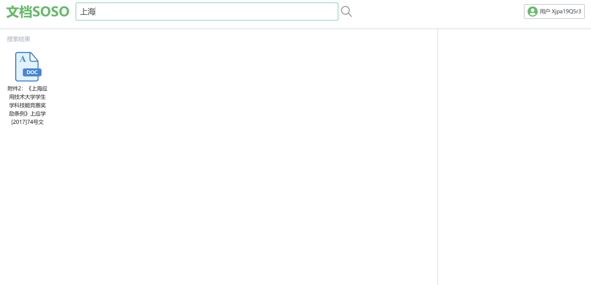
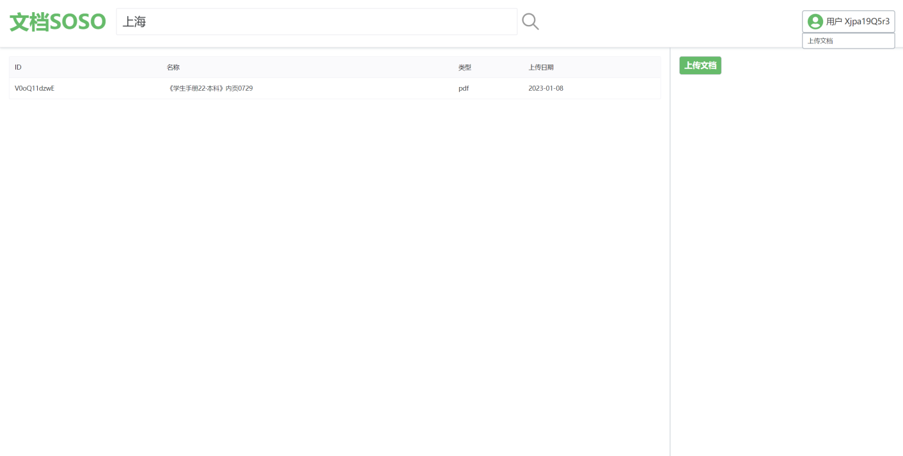

# 文档搜搜
[English](./README.md) | 中文

## 项目背景
现有的文档共享网站百度文档、豆丁网、道客巴巴，下载文档都是要收费的或者需要积分，因此，打算设计一个免费的文档共享网站，简洁且美观。用户可以上传自己的文档，也可以免费下载需要的文档。并且可以提供文档的在线预览。

## 开发栈
本系统采用 JAVA + Vue.js 前后端分离进行开发。后端端部分使用 SpringBoot + Mybatis 框架进行开发，数据库使用 Mysql8.0，前端使用 Vuejs 框架配合 Naive UI 组件库进行二次封装修改，文档预览功能通过部署 kkFileView 服务实现。

## 功能预览
1. 主页

2. 注册

3. 登录

4. 搜索文档

5. 文档预览

6. 已上传文档列表

7. 上传文档

8. 下载文档
